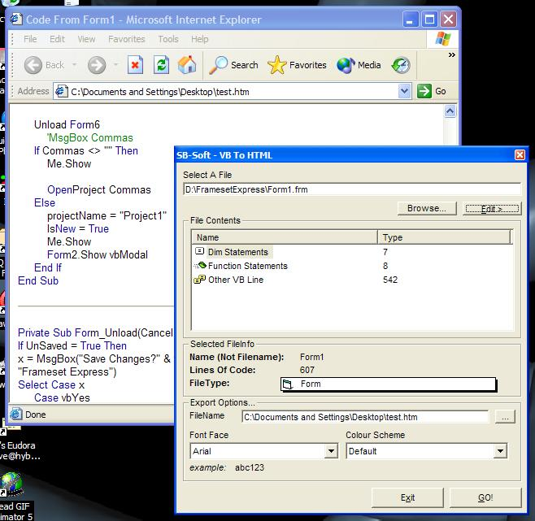



## VBtoHTML\!\!\!\!

### Description

Ever wanted to preserve the formatting from VB when ur posting an article? well this nifty app will do just that! it converts any VB file (i.e. .frm .bas .cls .ctl) into a formatted HTML File!!!!!!!! no more truncated code on psc :P

Includes well thought out error traps, and a has taken a long time to write so please comment/rate :) thanks.

steve b
 
### More Info
 
VB Code

HTML

             |
---                |---
**Submitted On**   |2003-08-27 20:22:42
**By**             |[Aimee Bailey](https://github.com/Planet-Source-Code/PSCIndex/blob/master/ByAuthor/aimee-bailey.md)
**Level**          |Intermediate
**User Rating**    |4.3 (26 globes from 6 users)
**Compatibility**  |VB 6\.0
**Category**       |[Coding Standards](https://github.com/Planet-Source-Code/PSCIndex/blob/master/ByCategory/coding-standards__1-43.md)
**World**          |[Visual Basic](https://github.com/Planet-Source-Code/PSCIndex/blob/master/ByWorld/visual-basic.md)
**Archive File**   |[VBtoHTML\!\!1636528272003\.zip](https://github.com/Planet-Source-Code/aimee-bailey-vbtohtml__1-48042/archive/master.zip)

